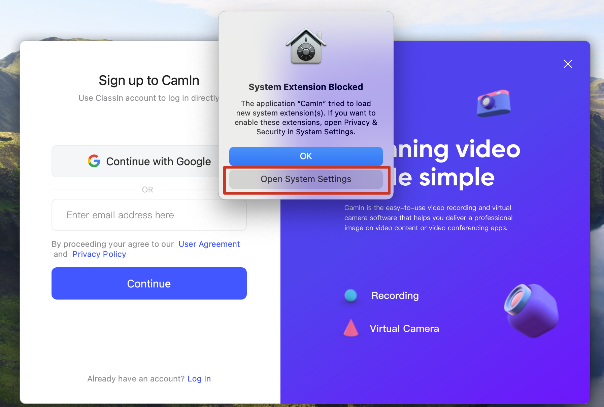
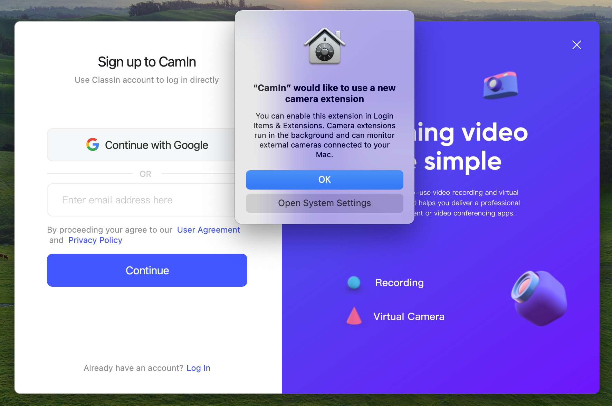
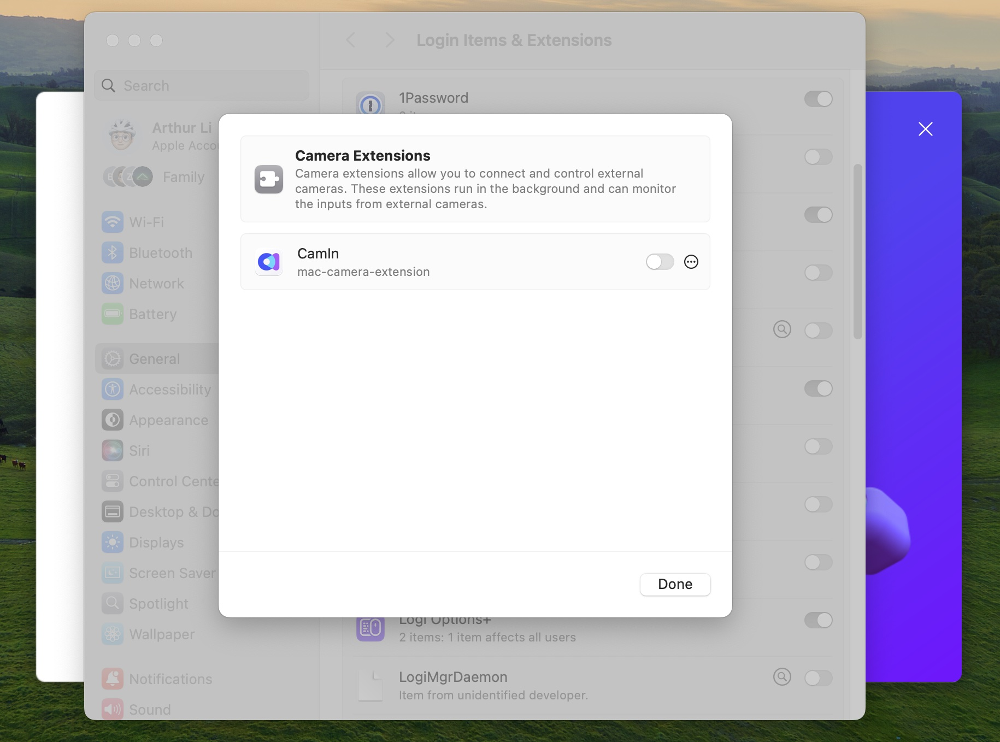

---
layout:
  title:
    visible: true
  description:
    visible: false
  tableOfContents:
    visible: true
  outline:
    visible: true
  pagination:
    visible: true
---

# \[Mac] How to install CamIn virtual camera

### Installation Instructions

For **macOS versions below 14**, you can simply install the software as usual. For **macOS 14 and 15**, however, you'll need to grant special permissions during installation. Follow the steps below based on your macOS version.

**macOS 14.0**

1.  Install and open the software. A system prompt saying "System Extension Blocked" will appear. Click on "Open System Settings" in this prompt.

    <figure><figcaption></figcaption></figure>


Alternatively, you can go to **Apple menu > System Settings > Privacy & Security > Security** to locate this setting.


2.  In the System Settings window, click "Allow."

    <figure><figcaption></figcaption></figure>

**macOS 15.0**

1.  Install and open the software. A system prompt saying "CamIn wants to use a new camera extension" will appear. Click on "Open System Settings" in this prompt.

    <figure><figcaption></figcaption></figure>


If you clicked "OK" initially, you can still access the settings by going to **Apple menu > System Settings > General > Login Items & Extensions > Camera Extensions**.


2.  In the settings window, toggle on CamIn.

    <figure><figcaption></figcaption></figure>

### Uninstallation Instructions

First, check your macOS version by clicking the **Apple menu > About This Mac**. Then, follow the steps below based on your macOS version.

#### **For macOS Versions Below 14.0**

1. Open the Terminal application.
2.  Enter the following command and press Enter:

    ```bash
    sudo rm -rf /Library/CoreMediaIO/Plug-Ins/DAL/classincam-mac-module.plugin
    ```

#### **For macOS Versions 14.0 and Above**

1. Restart your Mac in Recovery Mode and disable _System Integrity Protection (SIP)_.
   * For Apple silicon Macs, hold down the power button until you see the Apple logo and a progress bar.
   * For Intel-based Macs, hold down _CMD + R_ while restarting.
2.  In Recovery Mode, go to **Utilities > Terminal** in the menu bar, and enter:

    ```bash
    csrutil disable
    ```
3. Close Terminal and restart your Mac.
4.  After restarting, open Terminal and enter:

    ```bash
    systemextensionsctl developer on
    ```
5.  Next, to see details of the virtual camera, enter:

    ```bash
    systemextensionsctl list
    ```
6.  Finally, enter the following command to uninstall the extension:

    ```bash
    systemextensionsctl uninstall <teamid> <bundleid>
    ```

    > **Note**: You’ll find `<teamid>` and `<bundleid>` in the output from step. Exclude the `< >` symbols when typing them in.
7.  Once you see a success message, close Terminal and restart your Mac to complete the process.

    <figure><figcaption></figcaption></figure>
