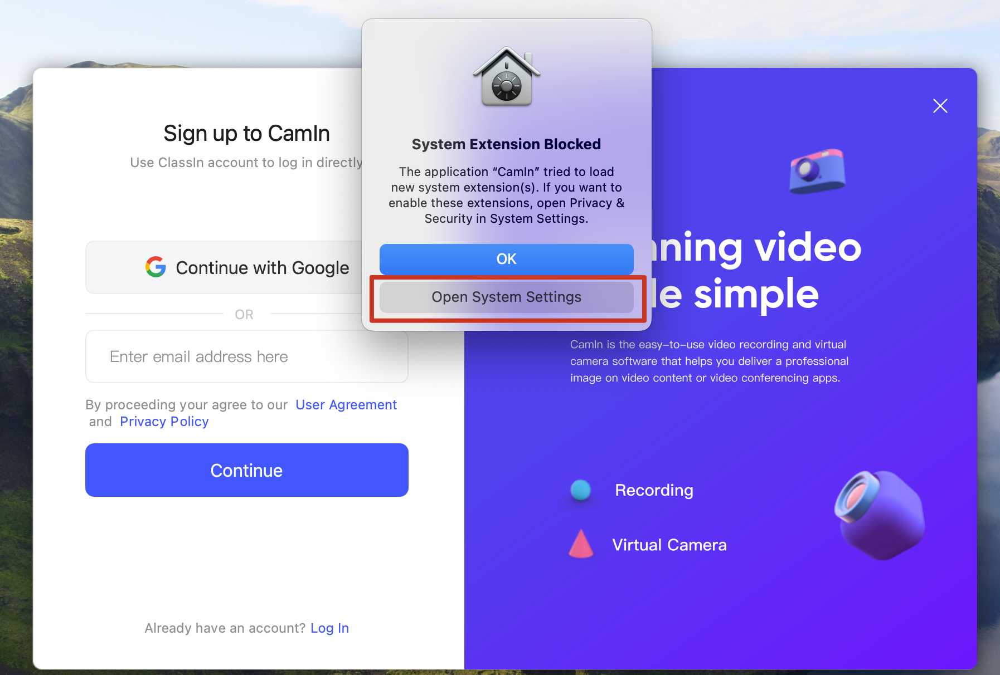

---
layout:
  title:
    visible: true
  description:
    visible: false
  tableOfContents:
    visible: true
  outline:
    visible: true
  pagination:
    visible: true
---

# CamIn virtual camera

### What is a virtual camera

A virtual camera(also called virtual webcam) is a software-based camera that simulates a physical webcam and allows users to send video and audio to other apps or devices as if it were a real webcam. It can be used to provide multiple type of sources  to applications such as video conferencing software, live streaming tool, or video chat services, even if the computer does not have a physical webcam.

### How CamIn virtual camera works

1. Add the sources you want to present to CamIn
2.  Select \[CamIn virtual camera] in the video software you are using to get started.

    <figure><figcaption></figcaption></figure>

### Sources CamIn supports

1. Audio/Video: Support audio/video files of mainstream formats, meanwhile support adjusting volume, speed, loop playback and so on.
2. Docs: Common document types such as PPT/PDF/WORD/EPUB are supported. PPT supports animation.
3. Images: support long pictures to adapt to the screen and scroll loading playback.
4. Screen casting: Support cell phones or tablet devices through Apple casting (AirPlay) and ClassIn casting, add as a content source.
5. SharingScreen: Support to share computer desktop or application window.
6. Camera
7. IP camera
