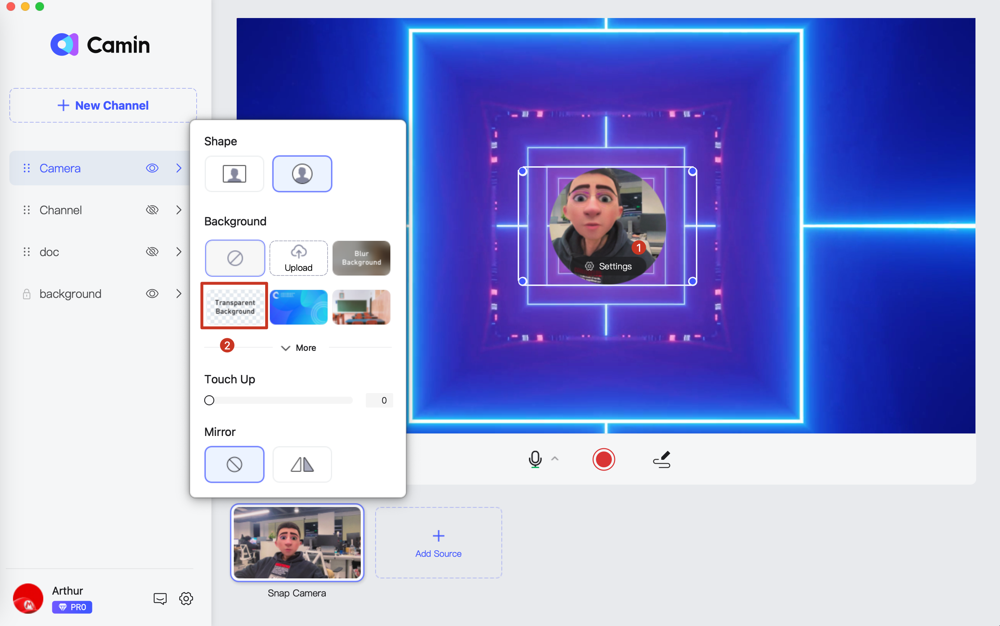

# How to set a video as virtual background?

### Step 1: Add video to background channel

Add your video in background channel, and then click on ‘settings’ to toggle on 'Loop' option.

<figure><figcaption></figcaption></figure>

### Step 2: Change camera setting

Choose the 'transparent background' option of the camera settings, then you can get a dynamic video background. You can also hide the camera channel or remove the camera altogether to get a pure video background.

<figure><figcaption></figcaption></figure>

### Final look

<figure><figcaption></figcaption></figure>
