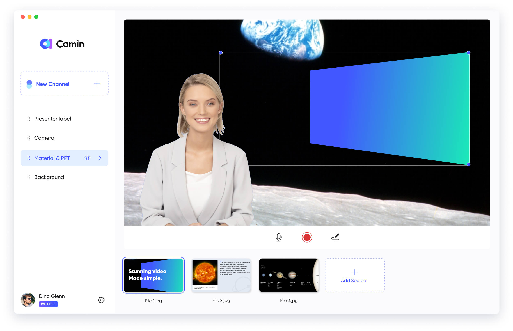

# How to Use a Virtual Camera on Video Conferences?

Video conferences have already become the norm for communication and collaboration. However, the limited features offered by most video calling apps can make these meetings dull and uninspiring. Fortunately, there is a solution: using a virtual camera. With a virtual camera like CamIn, you can enhance your video calls, business presentations, and client meetings by incorporating multiple media sources, camera angles, and video adjustments. Here's how to use one effectively:

### **Step 1 - Download CamIn**

Get started by downloading CamIn for free or upgrade to CamIn Pro for additional features and flexibility.

In your internet browser, enter [https://www.camin.net/](https://www.camin.net/). At the top-right of the page, click DOWNLOAD NOW to install CamIn Client.&#x20;

### Step 2 - Prepare Your Video Feed

Before connecting your virtual camera to a video call, you need to set up your video sources. This is where you can unleash your creativity and make your videos more captivating. CamIn offers numerous possibilities for customization.&#x20;

For example, you can add picture-in-picture layers to your video, featuring your webcam in a rounded view in one corner and your PowerPoint presentation as the primary scene. The ability to create multiple picture-in-picture layers and switch between various scenes provides endless opportunities for making your videos visually appealing and engaging.

<figure><figcaption></figcaption></figure>

### Step 3 - Connect to Your Video Conferencing App

Once you have set up your video feed in CamIn, it's time to connect it to your video conferencing app. In most video conferencing apps, you'll find a video icon that allows you to select your webcam or check its connection status. Depending on the app, this control may be located in the settings or directly on the main call interface.

For example, in ClassIn, you can find it on the main call interface. Simply click on the video icon, and you should see CamIn Virtual Camera listed among the options. Select CamIn Virtual Camera, and your video feed will appear in your video conferencing app, seamlessly integrating the enhanced visuals you created.

<figure><figcaption></figcaption></figure>

Using a virtual camera like CamIn can revolutionize your video conferences and calls, making them highly engaging and memorable. Download CamIn today to captivate your audience. With endless possibilities, you can deliver outstanding business presentations, client demos, and more. Embrace the power of a virtual camera to elevate the quality and impact of your virtual meetings.

&#x20;
