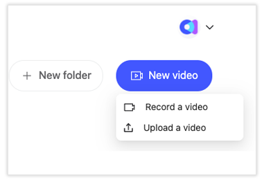
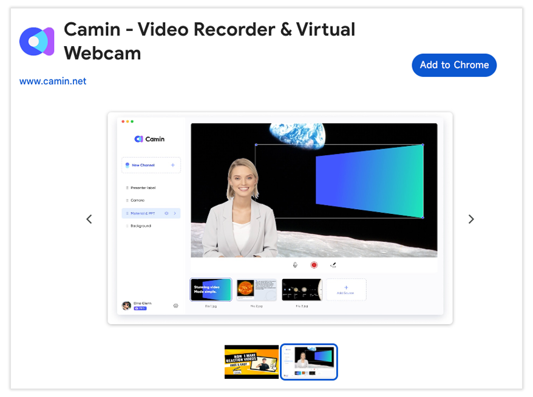

# How to embed a video in your email?

Adding videos to emails enhances engagement with dynamic, visually appealing content. In this tutorial, we will guide you through the process of using a CamIn to seamlessly insert videos into your Gmail messages, enhancing your communication.

## Record and Upload the Video to CamIn:

Use CamIn to record your video or upload an existing one here: [https://www.CamIn.net/account/video](https://www.camin.net/account/video). Ensure that the video is set to public.&#x20;

<figure><figcaption></figcaption></figure>

## Install the Extension:

Navigate to the Chrome Web Store and search for the extension called CamIn. Click on the chosen extension, then select "Add to Chrome" to install it. Follow the on-screen instructions to complete the installation process.

<figure><figcaption></figcaption></figure>

## Compose a New Email:

Open Gmail and click on "Compose" to create a new email.

In the email composition window you'll see a CamIn icon. Click on the CamIn icon and follow the prompts to select the video you want to insert.

Once satisfied, click "Send" to share your video-enhanced email.

<figure><figcaption></figcaption></figure>

## Test the Email:

Before sending the email to your recipients, conduct a test to ensure the video functions correctly and looks as intended.

&#x20;

Congratulations! You've successfully integrated a video into your email using CamIn, bringing a dynamic and engaging element to your communication. Experiment with different videos to find the best fit for your needs.
