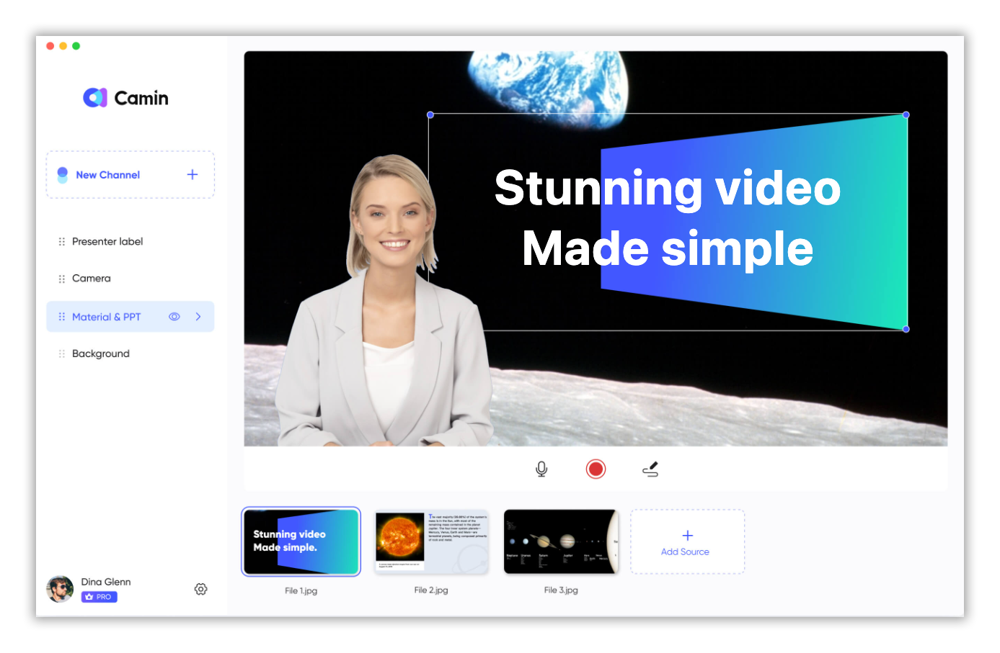
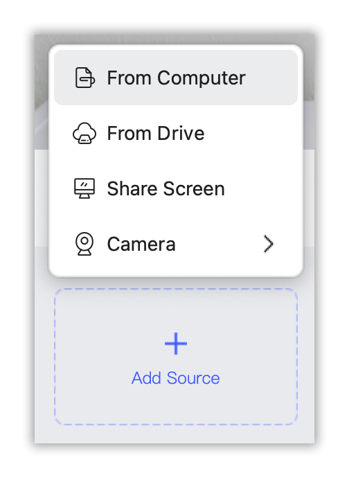
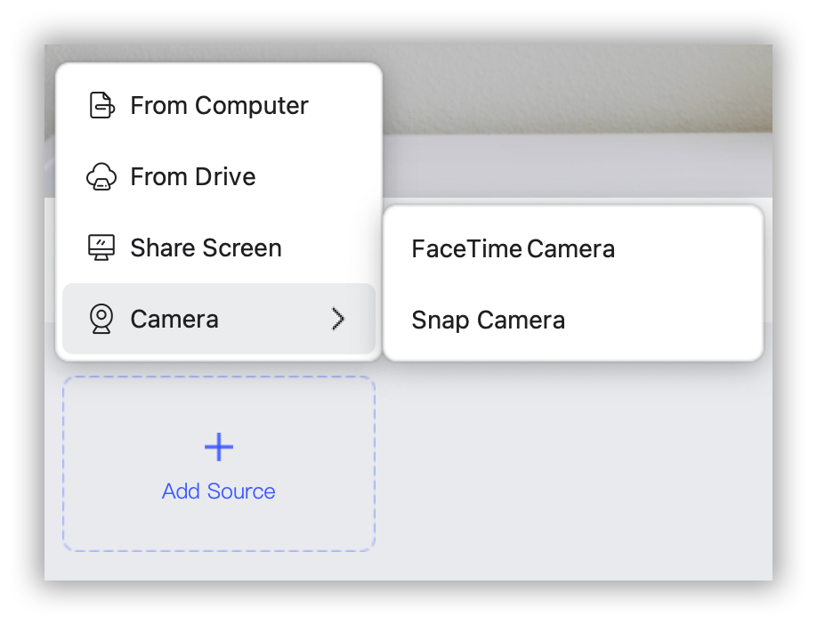
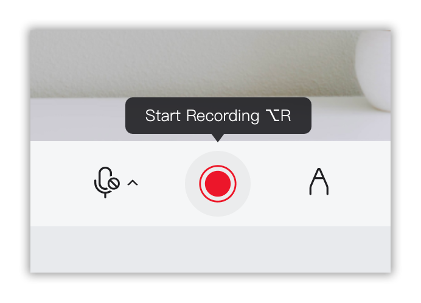
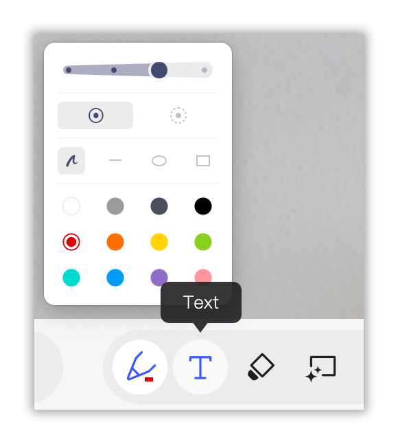
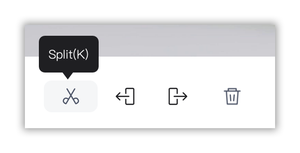
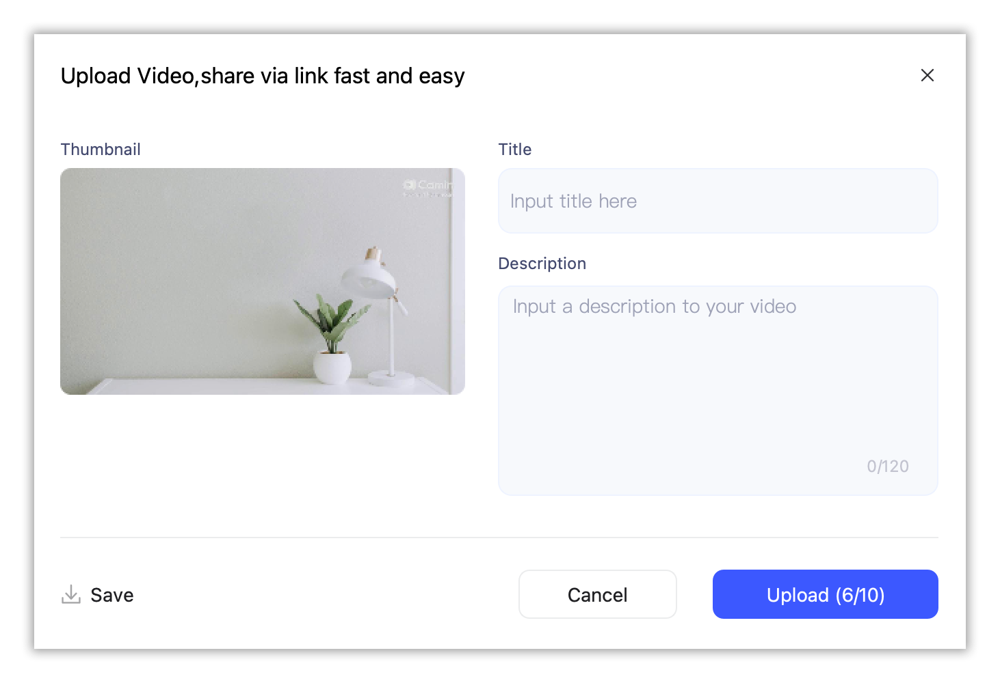

# How to Record Yourself Presenting a PowerPoint?

Whether you're a student, a professional, or an entrepreneur, knowing how to record yourself presenting a PowerPoint, Google Slides, or Keynote can greatly enhance your ability to connect with your audience. CamIn, a popular video recording app, offers a seamless solution to record and share your presentations with ease. In this article, we will guide you through the process of video recording yourself presenting using CamIn.

## Step 1: Prepare your presentation

Before you start recording, ensure that your presentation is well-prepared. Review your slides, rehearse your content, and make any necessary adjustments. A clear and concise presentation will result in a more engaging video.

## Step 2: Install and set up CamIn

In your internet browser, enter [https://www.camin.net/](https://www.camin.net/). At the top-right of the page, click DOWNLOAD NOW to install CamIn Client.&#x20;

Sign up for a CamIn account if you don't have one. Once installed, open CamIn and log in to your account.

## Step 3: Add source

With CamIn running, click ADD SOURCE to upload your PowerPoint, Google Slides, or Keynote presentation. Move your mouse cursor over the doc and then drag the blue dot to adjust the size.

## Step 4: Add camera

Before you start recording, CamIn provides a range of settings to customize your video. You can choose to record your doc, camera, or both. If you want to record yourself presenting, click ADD SOURCE to add your camera. You can also choose the microphone source depending on your requirements.

## Step 5: Practice and start recording

Take a moment to familiarize yourself with the recording controls. You'll see a red circle to start and stop the recording. Once you're ready, click on the record button to begin. Take a deep breath, stay relaxed, and present your slides as you would in a live setting.

## Step 6: Utilize CamIn's features

CamIn offers additional features that can enhance your video presentation. You can use the drawing tool to highlight important points on your slides or the mouse tracking feature to emphasize specific elements. These tools can help capture your audience's attention and make your presentation more interactive.

## Step 7: Review and edit your video

Once you've finished recording, you can review your presentation and make any necessary edits. Trim the beginning or end, remove any unwanted sections, or adjust the recording settings if needed. CamIn provides an intuitive interface for easy video editing.

## Step 8: Share your video

After you're satisfied with your video, it's time to share it with your audience. CamIn offers various sharing options, you can download your video or generate a link to share via email, messaging apps, or social media. Choose the option that best suits your needs and preferences.

With the user-friendly interface and powerful features, CamIn makes the entire process seamless and hassle-free. Leverage CamIn to create engaging video presentations and captivate your audience like never before.
