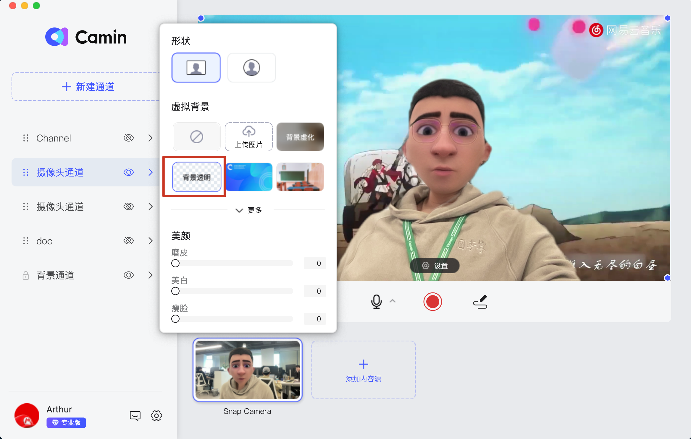

# 如何设置视频虚拟背景？

### 在背景通道添加视频

将视频添加到背景通道并选中，然后设置视频【循环播放】；

<figure><figcaption>
background_video
</figcaption></figure>

### 人像设置为【背景透明】

将人像设置为背景透明效果，即可得到视频动态背景。你也可以把摄像头通道隐藏，或将摄像头删除，得到一个纯粹的视频背景。

<figure><figcaption>
background-virtual.png
</figcaption></figure>
