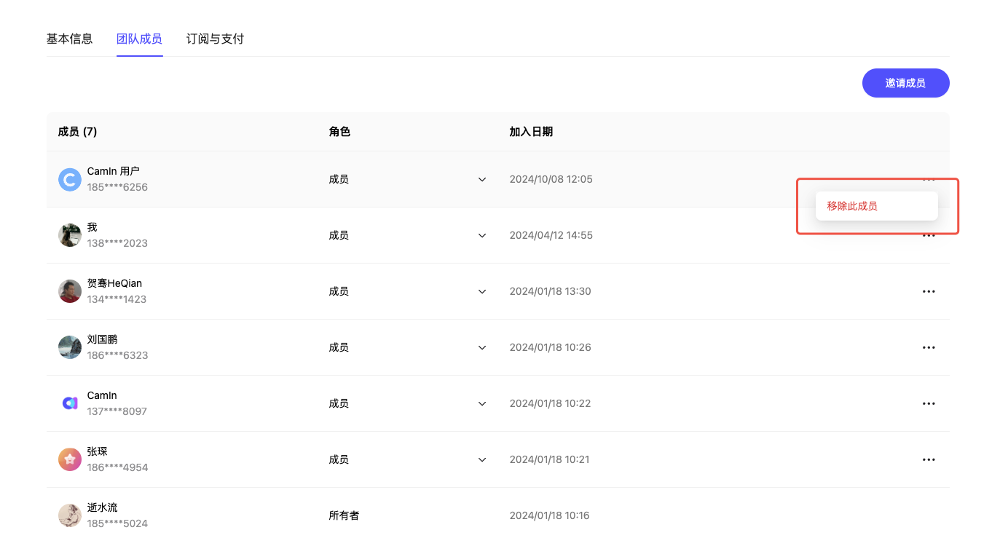

# CamIn 开映团队版

CamIn 开映团队版是专门针对团队多人共同使用 CamIn 打造。通过 CamIn 开映团队版，你可以轻松管理你的团队成员以及团队的视频资产。尤其适合多人团队生产、管理、分发视频使用。以下是团队版关键操作说明。

### 创建团队

方法 1: 通过 Camin 开映官网创建团队

1. 登录 CamIn 开映官网 👉 [www.camin.cn](https://www.camin.cn)
2.  点击左上角的新建团队按钮创建团队

    <figure><figcaption></figcaption></figure>

3.  你也可以点击右上角的头像，在展开的弹窗上点击“新建团队”创建团队，如下图。

    <figure><figcaption></figcaption></figure>

方法 2：通过 CamIn 开映客户端创建团队

1.  电脑上打开并登录 CamIn 开映客户端，点击左下角头像-新建团队，创建团队。

    <figure><figcaption></figcaption></figure>

### 团队升级会员

CamIn 开映免费版本和专业版本均可以免费创建一个团队。免费创建的团队可以至少邀请 3 名成员加入团队。与此同时，免费创建的团队还拥有 5 G的云存储空间。详情的权益对比，可以[点击此处](https://www.camin.cn/pricing)查看。以下是团队版开通会员的方法。

在网页开通团队版会员：

1.  创建团队后，点击页面右上角的“开通会员”按钮；

    <figure><figcaption></figcaption></figure>
2.  在打开的窗口上即可看到开通会员的付费窗口，请根据你的团队人数选择购买的席位数或时长，扫码开通即可。

    <figure><figcaption></figcaption></figure>

在客户端开通团队版会员：

1. 点击左下角头像，在弹出的窗口中切换到已经创建的团队。
2. 在软件内点击水印处，或点击升级会员按钮即可开通会员。

### 邀请成员加入团队

创建团队之后，你可以邀请成员加入团队。注意，免费版团队至多可以有 3 位成员，也就是说你可以额外邀请 2 人加入团队。开通会员的团队版，根据你购买的席位数量决定你可以邀请的成员人数。举例：如果你购买 3 个席位，除去你作为团队所有者之外，可以再邀请 2 位成员加入。以下是邀请成员加入团队的方法。

1. 登录 [CamIn 官网](https://www.camin.cn), 点击左上角的“邀请成员”按钮；

<figure><figcaption></figcaption></figure>

1.  在打开的窗口上即可以看到“邀请成员”的连接，复制此连接发给成员。如下图：

    <figure><figcaption></figcaption></figure>

2.  成员点击邀请链接即可加入团队。<mark style="color:red;">注意：如果团队席位数已满，则不能再加入团队，你需要再购买席位才可以邀请。</mark>

    <figure><figcaption></figcaption></figure>

### 管理团队成员

假如团队成员有人离职或变更，你可以在团队成员管理中操作将某位成员移除，这样你可以邀请其他成员加入团队。具体的操作方法如下：

1. 登录 [CamIn 官网](https://www.camin.cn), 点击右上角头像，切换到你的团队；
2.  点击窗口下方的“团队管理”按钮；

    <figure><figcaption></figcaption></figure>
3.  在打开的页面上，点击“团队成员” 按钮，找到你想要移除的成员，即可操作

    <figure><figcaption></figcaption></figure>
