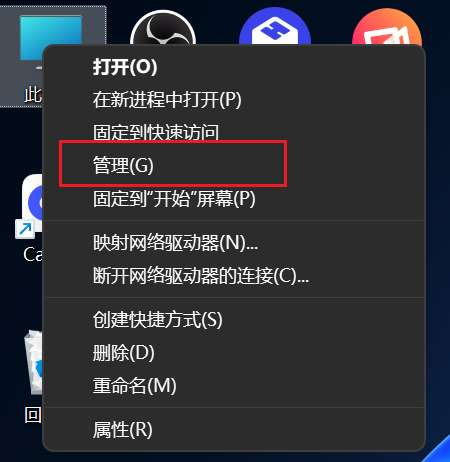
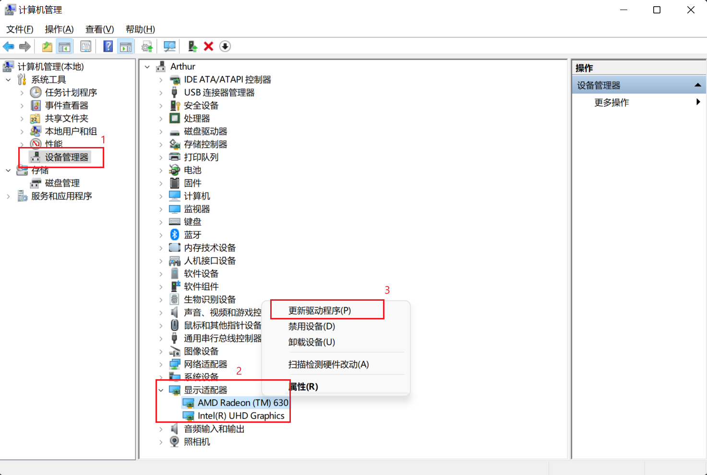

# 👺 设置虚拟背景过程中总是闪退，怎么办？

此问题仅在 Windows 电脑中出现，更新电脑的显卡驱动，基本可以解决此问题，提供以下两种方法可以更新显卡驱动。

### **方法1：通过 windows 设备管理器更新**

1\. 在【此电脑】点击右键，选择【管理】；

<figure><figcaption></figcaption></figure>

2\. 点击设备管理器，打开【显示适配器】，在出现的列表中依次点击右键并选择【更新驱动程序】即可。

<figure><figcaption></figcaption></figure>

### **方法2：通过第三方驱动管理软件更新**

1\. 下载并安装驱动精灵，[点击下载](http://www.drivergenius.com/)

2\. 打开驱动精灵，点击【驱动管理】检查驱动程序

<figure><figcaption></figcaption></figure>

3\. 找到检查结果中包括【显卡】2字的驱动程序，点击【升级驱动】

<figure><figcaption></figcaption></figure>

4\. 升级完成之后，重启 CamIn 即可正常使用。

如果问题仍然存在，请加入[用户交流群](../lian-xi-wo-men.md#wen-ti-huo-jian-yi)反馈，我们第一时间解答。
