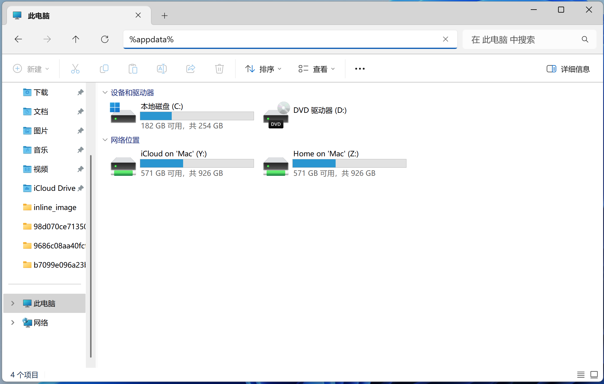

---
layout:
  title:
    visible: true
  description:
    visible: false
  tableOfContents:
    visible: true
  outline:
    visible: true
  pagination:
    visible: true
---

# 🖥️ 在 Classin 大屏上录制异常，怎么办？

1. 退出 Camin 软件；
2.  打开文件管理器，在文件地址栏输入 %appdata%，敲回车键打开；

    <figure><figcaption></figcaption></figure>
3.  找到 Camin 文件夹并打开，然后找到 settings.ini 文件

    <figure><figcaption></figcaption></figure>

    <figure><figcaption></figcaption></figure>
4.  用记事本打开 settings.ini 文件，把 RecEncodeWay=0 这里的 0 修改为 1 ，保存；

    <figure><figcaption></figcaption></figure>
5. 重启 Camin 软件
