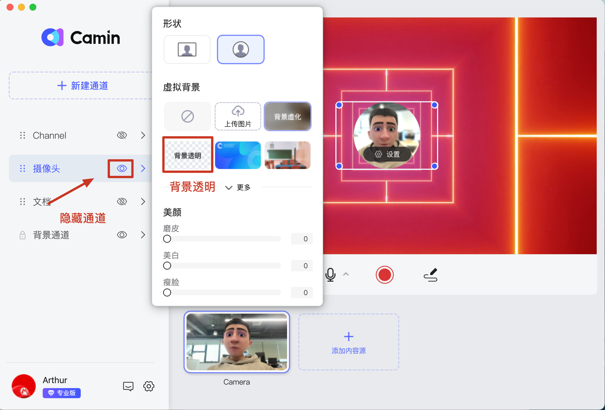

---
layout:
  title:
    visible: true
  description:
    visible: false
  tableOfContents:
    visible: true
  outline:
    visible: true
  pagination:
    visible: true
---

# 😌 如何把视频设置为虚拟背景？

### 在背景通道添加视频

将视频添加到背景内容区并选中，然后设置视频【循环播放】；此时你便得到了视频动态背景。

<figure><figcaption></figcaption></figure>

### 人像设置为【背景透明】

如果你想要实现更沉浸的效果，可以把人像设置为【背景透明】。你也可以把摄像头通道隐藏，或将摄像头删除，得到一个纯粹的视频背景。

<figure><figcaption></figcaption></figure>
