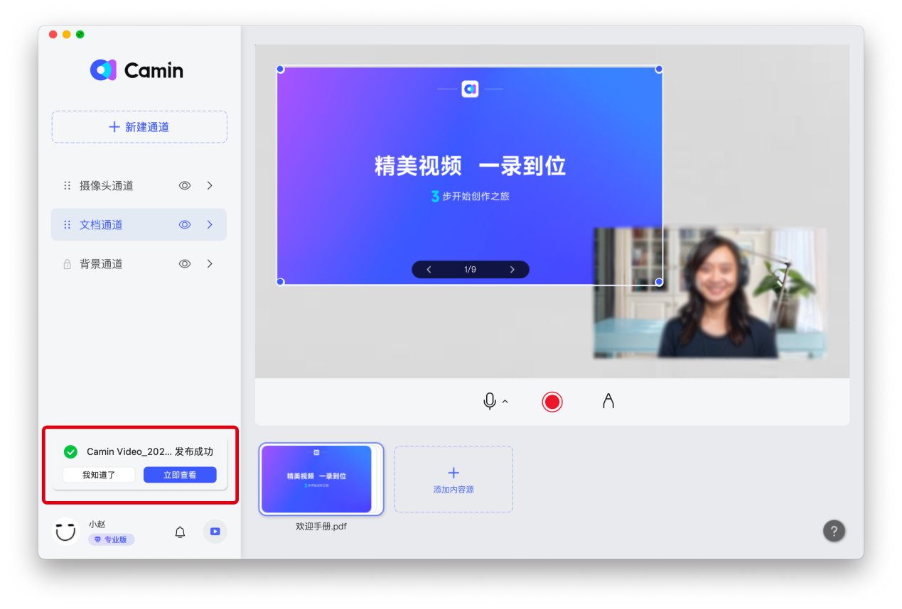
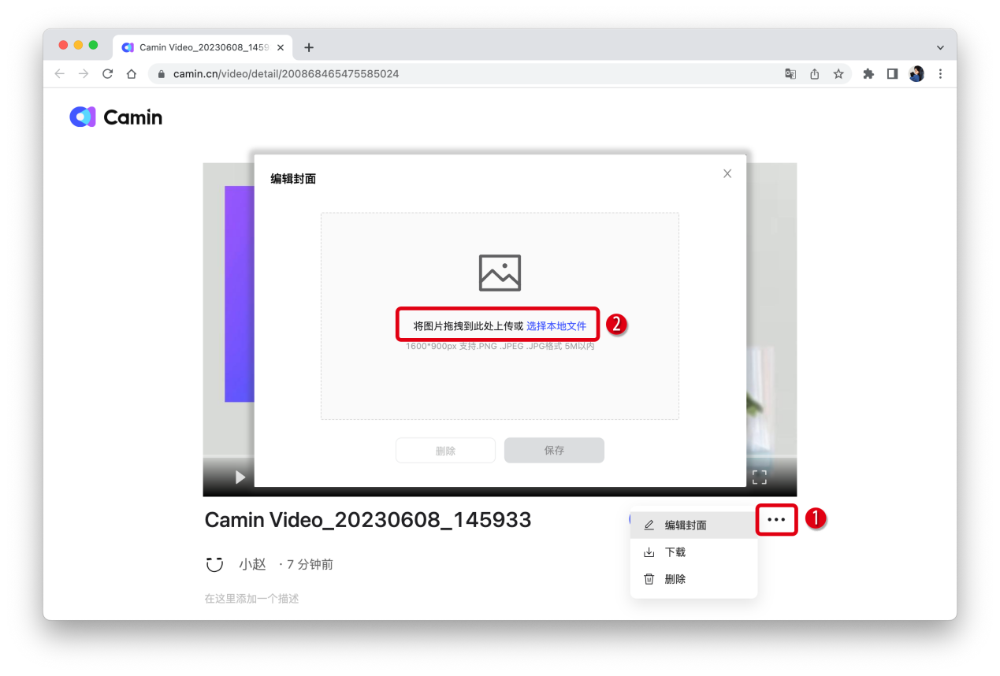

---
layout:
  title:
    visible: true
  description:
    visible: false
  tableOfContents:
    visible: true
  outline:
    visible: true
  pagination:
    visible: true
---

# 💾 保存或分享视频

### 保存到本地

剪辑完成后，单击【完成录制】，在弹出的面板左下方点击【保存到本地】，可以选择视频保存位置并保存到电脑本地。

.png>)

### 保存到云空间

单击【完成录制】，在弹出的面板里可以编辑发布标题和视频描述。单击【发布视频】，可完成视频云端储存。

.png>)

储存完成后，在头像上方会提醒发布成功。

## 分享视频

点击【立即查看】或【我的视频】，进入开映官网，点击视频右下角的【分享】键，在弹窗中可以复制本条视频的链接，或复制/下载二维码，分享本条视频。

.png>)

## 编辑视频封面

点击视频右下角的【…】键，可以编辑封面、下载视频或删除视频。点击【编辑封面】在弹窗中可以上传视频封面。封面尺寸要求1600\*900px，支持.PNG .JPEG .JPG格式，大小在5M以内。

