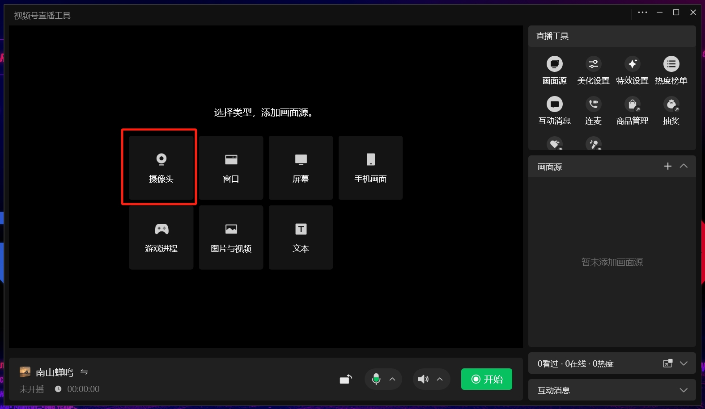

---
layout:
  title:
    visible: true
  description:
    visible: false
  tableOfContents:
    visible: true
  outline:
    visible: true
  pagination:
    visible: true
---

# 🎉 使用 CamIn 开映向视频号直播

### 通过RTMP推流开播

#### 在视频号创建直播

1.进入[视频号助手](https://channels.weixin.qq.com/login.html)，用管理员微信进行扫码登录。

2.首页点击【直播管理】-【直播间管理】，完善基础信息，再点击【创建】，进入直播配置界面。

<figure><figcaption></figcaption></figure>

3. 在直播配置界面，可以看到【推流地址】和【推流密钥】，准备好这两部分信息，回到开映软件。需要注意：每创建一次直播间，推流地址更换一次。

<figure><figcaption></figcaption></figure>

#### 在开映中配置直播推流

#### 配置推流地址

在软件工具栏点击【直播推流】。在打开的窗口点击【添加直播平台】，然后分别选择你要直播的平台。这里选择视频号，然后在打开的窗口中依次填写以下信息：

<figure><figcaption></figcaption></figure>

* 直播间名称：必填项，你的视频号名称。此项用于区分不同直播平台使用。
* 推流地址：必填项，回到视频号复制推流地址并粘贴到此处，注意检查格式。仅支持RTMP协议地址，格式错误时则会提示“请填写正确的RTMP地址”；‘
* 推流密钥：必填项，回到视频号复制推流密钥并粘贴到此处。

#### 开始直播

完成直播配置后，点击窗口上的【开始直播】，再回到视频号，点击【开始直播】即可。

#### 结束直播

先在【视频号助手】点击【结束直播】，再回到开映点击【停止直播】，即可结束推流直播。否则线上直播间内用户会出现观看黑屏现象。

### 通过虚拟摄像头开播

此方法需要配合视频号直播工具使用。以下是详细方法：

#### 添加摄像头

在微信windows客户端点击左下角更多设置，下载并安装【视频号直播工具】，安装完成后打开。点击【摄像头】，见下图：

<figure><figcaption></figcaption></figure>

#### 选择 CamIn virtual camera 作为摄像头

点击摄像头后，在打开的窗口中选择【CamIn virtual camera】作为摄像头，见下图：

<figure><figcaption></figcaption></figure>

摄像头设置完成后，请打开 CamIn 开映软件进行操作即可。

### 注意事项

1. 推流到视频号需要获取推流地址和推流密钥。你需要先完成视频号认证才能获取直播推流相关信息。
2. 视频号认证路径：微信—发现—视频号—右上角个人中心—我的视频号—我的视频号详情页—更多设置—认证。
3. 当前仅支持向一个平台推流，暂时不支持同时向多个平台推流。
4. 所有在右侧预览区域内容的画面，均会被直播推流。软件内的设置窗口、画笔面板等不会被推流，请放心使用。
5. 直播过程中，无法切换推流平台，需要停止当前直播后，重新勾选推流平台并开启直播。
6. 暂时不支持录制直播推流，你可以在直播平台开启直播回放。
