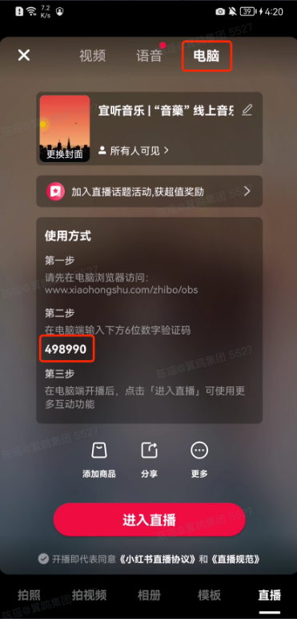
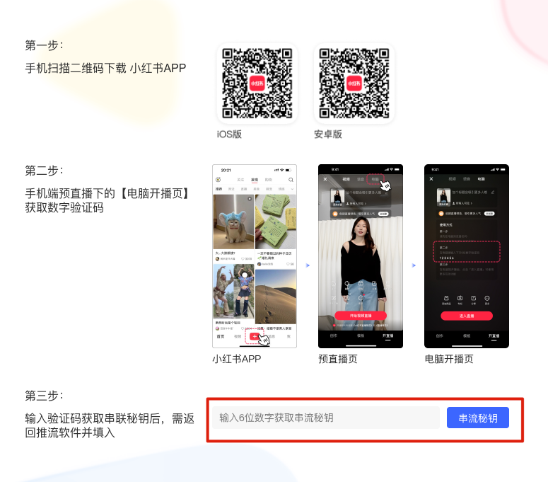

---
layout:
  title:
    visible: true
  description:
    visible: false
  tableOfContents:
    visible: true
  outline:
    visible: true
  pagination:
    visible: true
---

# 📕 使用 CamIn 开映向小红书直播

### 1. **获取推流码**

手机打开小红书 app，打开预直播页面，切换到 「电脑」 tab，如下图：

<figure><figcaption></figcaption></figure>

### **2. 获取串流秘钥**

1. 打开 [小红书直播平台](https://www.xiaohongshu.com/zhibo/robs)，登录小红书账号。
2. 点&#x51FB;**「去OBS开播」。**

<figure><figcaption></figcaption></figure>

3. 然后输入上一步复制的6位数字，可以获取串流秘钥，复制这段密钥。

<figure><figcaption></figcaption></figure>

### 3. **开映推流配置**

打开开映，点击直播推流，依次填写直播间名称、推流地址和推流密钥。填写完成后点击添加直播平台。

直播间名称：你小红书的昵称

推流地址： rtmp://live-push.xhscdn.com/live

推流密钥：上一步输入验证码后生成的密钥

<figure><figcaption></figcaption></figure>

### 4. 手机端-进入直播

预直播页 --> 点击「进入直播」 即可。

### 5. 结束直播

先在手机端结束，然后再结束 CamIn 推流。

### 注意事项

1\. 首次使用 CamIn 在小红书直播时，建议先试播一次；

2\. 一定要先在 CamIn 点「开始直播」，再在小红书里点「开始直播」；

3\. 手机端生成的6位数字验证码具有时效性，生成后请在12小时内利用数字验证码在「小红书电脑直播教程」 页面获取串流秘钥；

4\. 每次「结束直播」 再「开启直播」需要先在手机端生成新的6位数字验证码，然后再利用新的6位数字验证码在「小红书电脑直播教程]」页面获取串流秘钥，然后回到 CamIn 软件里更新。

