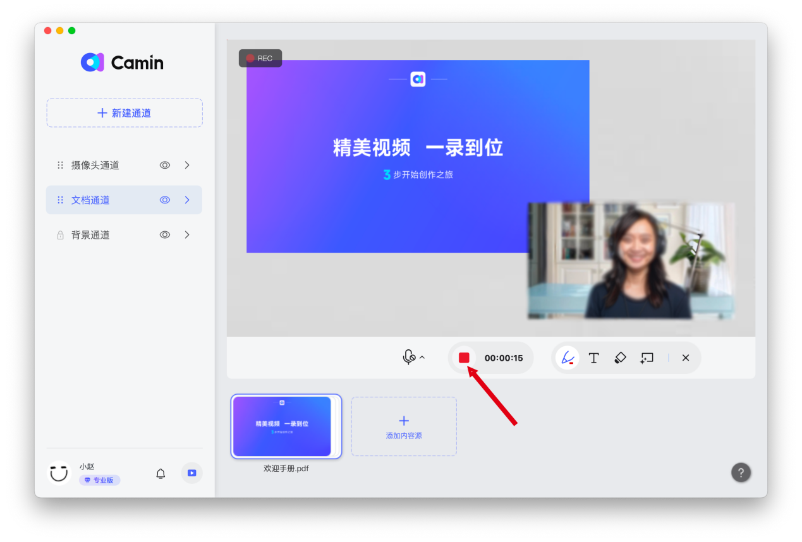

# 四、高清录制/涂鸦标记

### 开始录制

点击红色按钮，即可开始录制视频。

.png>)

### 画笔涂鸦

单击【画笔】图标即可使用画笔辅助讲解，单击【T】图标可以添加文字描述，【橡皮擦】可以将绘制内容擦除，选择【清屏】按钮可以将涂鸦内容一键清除。

### 停止与保存录制

1. 停止录制：单击停止录制按钮，即可停止当前录制；

1. 继续录制：在打开的窗口中点击【继续录制】即可继续录制视频；
2. 保存录制：点击【完成录制】即可将录制的视频保存到电脑的指定位置。

.png>)

### 调整画质

点击客户端左下角你的头像，进入【通用设置】，可以选择画质和帧率

.png>)

### 画中画模式

可根据录制需求，调整画面模式，如仅人像模式、人像+文档模式、仅文档模式、仅共享屏幕等模式。

#### 调整通道层级

点击通道左侧【:::】，长按上下拖动，可调整当前通道所在层级。通道位置在最上面时，通道内的内容置于顶层。

示例：如果希望摄像头的人像在文档上方，则调整摄像头通道在文档通道上方。

.png>)

#### 新建通道

点击【新建通道】，在应用界面的下方点击【添加内容源】。注意：新创建的通道会平铺在右侧画面区域，可以按照如下方式隐藏或删除通道。

#### 隐藏或取消隐藏通道

点击通道右侧【小眼睛符号】，可对该通道进行隐藏或取消隐藏

.png>)

#### 删除通道：

点击通道右侧【>】符号，进入通道设置，点击右上方删除键，可删除该通道

.png>)
