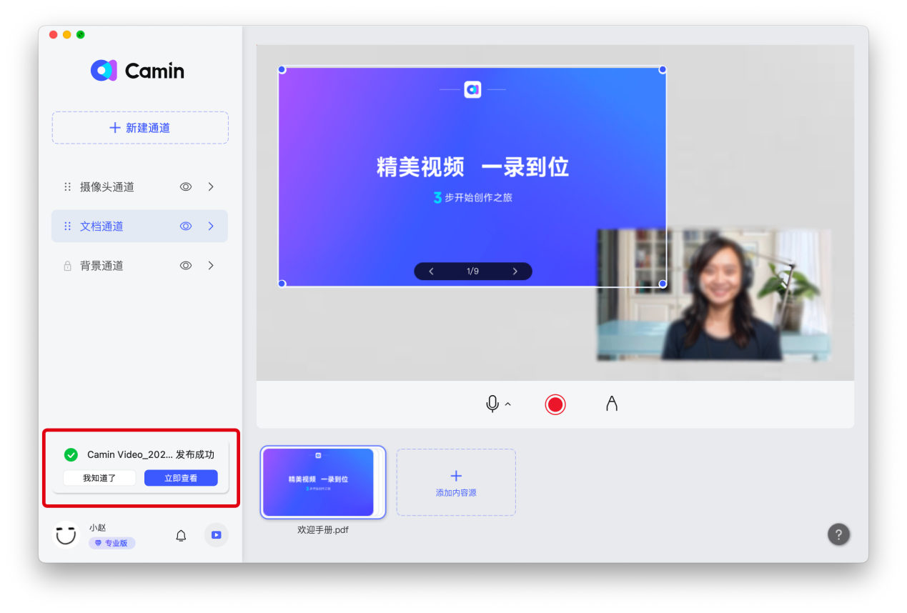
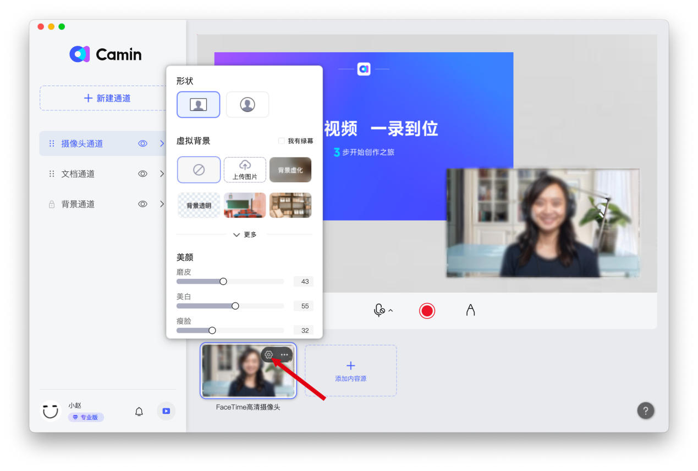
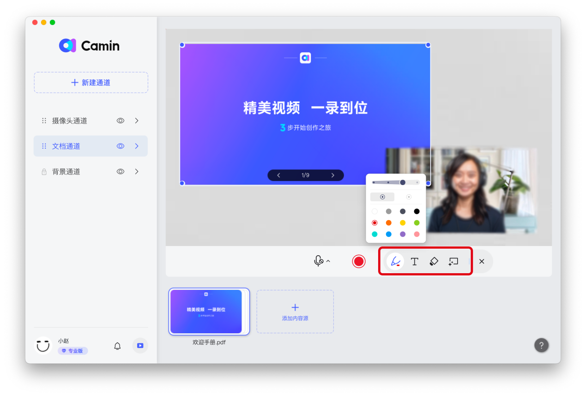

# 添加演示文件

点击选择文档通道，在应用的界面下方点击【添加内容源】，在打开的窗口中选择【从本地选择】添加你的演示文档。

<mark style="color:orange;">开映支持添加的文件类型：</mark>

1. <mark style="color:orange;">PPT 演示文稿</mark>
2. <mark style="color:orange;">Word 文档</mark>
3. <mark style="color:orange;">Excel文档</mark>
4. <mark style="color:orange;">PDF 文档</mark>
5. <mark style="color:orange;">图片</mark>
6. <mark style="color:orange;">视频</mark>
7. <mark style="color:orange;">音频</mark>
8. <mark style="color:orange;">Epub 电子书</mark>

### 文档翻页、跳页

#### PPT翻页

鼠标移动到PPT上，点击左箭头向上翻页、或点击右键头向下翻页；如果有动画，点击箭头上一步或下一步可播放动画，在PPT画面上单击鼠标，或按键盘空格也可以播放动画并翻页。

（配图1-2）

#### PPT跳页

在应用界面的下方找到演示文档，鼠标单击，即可展开PPT全部页面。单击某个页面即可跳页，点击左侧按钮即可返回。

（配图1-3）

#### 布局调整

调整文档的大小：鼠标移动到调整对象上方后再拖动蓝色圆点，即可调整大小；

（配图1-5：标记蓝色圆点）

调整相对位置：在文档上【单击】鼠标不放，然后移动鼠标即可调整位置；

最大化文档：鼠标双击人像或文档可以将文档最大化，再次双击还原；

### 二、共享屏幕

在应用的下方点击【添加内容源】，在打开的窗口中选择【共享屏幕】，然后选择要共享的应用或者桌面即可。

（配图2-1：标注共享屏幕）

注意：共享应用时，不能将应用最小化，最小化之后共享中断。

### 三、人像美颜

### 添加人像

点击选择摄像头通道，在应用的界面下方点击【添加内容源】，在打开的窗口中选择【添加摄像头】

（配图3-1:标记添加摄像头）

### 人像美颜

单击人像，然后鼠标移动到应用界面下方的人像区域，点击【设置】按钮。在展开的面板中调整人像特效。可以设置人像的形状、背景抠像、美颜或贴纸。

（配图3-2：标记设置）

注意：设置特效要求较高硬件配置，如果出现卡顿情况，请适当关闭特效。

#### 人像布局

调整人像的大小：鼠标移动到调整对象上方后再拖动蓝色圆点，即可调整大小；

（配图3-3：标记蓝色圆点）

调整相对位置：在人像上【单击】鼠标不放，然后移动鼠标即可调整位置；

最大化人像：鼠标双击人像可以将人像最大化，再次双击还原；

注意：如果出现摄像头被文档内容遮盖，点击通道左侧【:::】，长按上下拖动通道，将摄像头通道调整到文档通道上方，实现摄像头在文档图层上方的效果。

### 四、高清录制/涂鸦标记

### 开始录制

点击红色按钮，即可开始录制视频。

（配图4-1：标记红色录制键）

### 画笔涂鸦

单击【画笔】图标即可使用画笔辅助讲解，单击【T】图标可以添加文字描述，【橡皮擦】可以将绘制内容擦除，选择【清屏】按钮可以将涂鸦内容一键清除。

（配图4-2：标记画笔工具）

### 停止与保存录制

1. 停止录制：单击停止录制按钮，即可停止当前录制；

（配图4-3：标记停止录制）

1. 继续录制：在打开的窗口中点击【继续录制】即可继续录制视频；
2. 保存录制：点击【完成录制】即可将录制的视频保存到电脑的指定位置。

（配图4-4：标记完成录制）

### 调整画质

点击客户端左下角你的头像，进入【通用设置】，可以选择画质和帧率

（配图4-5: 步骤1头像 步骤2通用设置）

### 画中画模式

可根据录制需求，调整画面模式，如仅人像模式、人像+文档模式、仅文档模式、仅共享屏幕等模式。

#### 调整通道层级

点击通道左侧【:::】，长按上下拖动，可调整当前通道所在层级。通道位置在最上面时，通道内的内容置于顶层。

示例：如果希望摄像头的人像在文档上方，则调整摄像头通道在文档通道上方。

（配图4-6：标记左侧6个点点）

#### 新建通道

点击【新建通道】，在应用界面的下方点击【添加内容源】。注意：新创建的通道会平铺在右侧画面区域，可以按照如下方式隐藏或删除通道。

（配图4-7：标记新建通道）

#### 隐藏或取消隐藏通道

点击通道右侧【小眼睛符号】，可对该通道进行隐藏或取消隐藏

（配图4-8：标记小眼睛）

#### 删除通道：

点击通道右侧【>】符号，进入通道设置，点击右上方删除键，可删除该通道

（配图4-9：点击>，配图4-10：删除键）

### 音视频剪辑

录制结束后，单击【停止录制】按钮，在弹出的面板里可以进行剪辑。根据下方音频波形的变化，可以找到讲解过程中的卡顿、口癖、清嗓子等片段，然后通过以下两种方式完成快速剪辑。

### 快速裁切[​](https://support.camin.cn/docs/features/how-to-trim-your-video%22%20/l%20%22%E5%BF%AB%E9%80%9F%E8%A3%81%E5%88%87%22%20/o%20%22%E5%BF%AB%E9%80%9F%E8%A3%81%E5%88%87%E7%9A%84%E7%9B%B4%E6%8E%A5%E9%93%BE%E6%8E%A5)

方法1 ：使用【剪刀】工具，将视频两次分割，然后点击【删除】键，将片段删除

方法2：使用【剪刀】工具分割片段，再拖拽裁切头部或尾部删掉不用的片段

（配图5-1）

### 移动视频位置

选中裁剪好的视频片段，点击【前移】或【后移】键可以调整视频位置

（配图5-2）

### 删除视频片段

选中裁剪好的视频片段，点击【删除】键可以删掉该片段

（配图5-3）

### 撤销与重做[​](https://support.camin.cn/docs/features/how-to-trim-your-video%22%20/l%20%22%E6%92%A4%E9%94%80%E4%B8%8E%E9%87%8D%E5%81%9A%22%20/o%20%22%E6%92%A4%E9%94%80%E4%B8%8E%E9%87%8D%E5%81%9A%E7%9A%84%E7%9B%B4%E6%8E%A5%E9%93%BE%E6%8E%A5)

如不小心删错，可以通过撤销与重做，恢复错删的内容

（配图5-4）

### 六、本地保存/云端发布、一键分享观看

### 本地保存

剪辑完成后，单击【完成录制】，在弹出的面板左下方点击【保存到本地】，可以选择视频保存位置并保存到电脑本地

（配图6-1）

### 云端储存发布

单击【完成录制】，在弹出的面板里可以编辑发布标题和视频描述。单击【发布视频】，可完成视频云端储存。

（配图6-2）

储存完成后，在头像上方会提醒发布成功。

（配图6-3）

### 视频分享

点击【立即查看】或【我的视频】，进入开映官网，点击视频右下角的【分享】键，在弹窗中可以复制本条视频的链接，或复制/下载二维码，分享本条视频。

（配图6-4）s

### 编辑视频封面

点击视频右下角的【…】键，可以编辑封面、下载视频或删除视频。点击【编辑封面】在弹窗中可以上传视频封面。封面尺寸要求1600\*900px，支持.PNG .JPEG .JPG格式，大小在5M以内。

（配图6-5）
