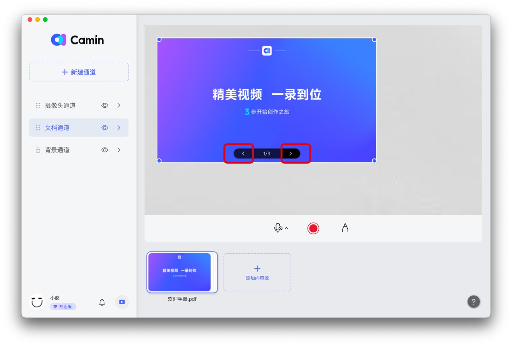

# 一、添加演示文件

点击选择文档通道，在应用的界面下方点击【添加内容源】，在打开的窗口中选择【从本地选择】添加你的演示文档。

 (1).png>)

开映支持添加的文件类型：

1. PPT 演示文稿
2. Word 文档
3. Excel文档
4. PDF 文档
5. 图片
6. 视频
7. 音频
8. Epub 电子书

## PPT翻页

鼠标移动到PPT上，点击左箭头向上翻页、或点击右键头向下翻页；如果有动画，点击箭头上一步或下一步可播放动画，在PPT画面上单击鼠标，或按键盘空格也可以播放动画并翻页。

## PPT跳页

在应用界面的下方找到演示文档，鼠标单击，即可展开PPT全部页面。单击某个页面即可跳页，点击左侧按钮即可返回。

 (1).png>)

## 布局调整

### 调整文档的大小

鼠标移动到调整对象上方后再拖动蓝色圆点，即可调整大小。

 (1).png>)

### 调整相对位置

在文档上【单击】鼠标不放，然后移动鼠标即可调整位置。

### 文档全屏展示

鼠标双击文档可以将文档最大化，再次双击还原。

